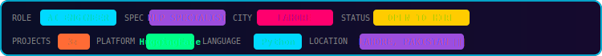
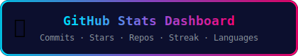

<div align="center">

[](https://git.io/typing-svg)

<br/>

[](https://linkedin.com/in/abdul-hadi-a039972b7)
[](https://huggingface.co/abdulhadi0239209)
[](https://github.com/abdulhadi0-byte)

<br/>

[](https://github.com/abdulhadi0-byte)

<br/>


<br/>

[](https://github.com/abdulhadi0-byte?tab=followers)
[](https://huggingface.co/abdulhadi0239209)
[](https://github.com/abdulhadi0-byte)
[](https://github.com/abdulhadi0-byte)

</div>


##  About Me

```python
class AbdulHadi:
    role       = ["AI Engineer", "NLP Specialist", "Builder & Deployer"]
    education  = "AI & Data Science Student — Lahore, Pakistan 🇵🇰"
    location   = "Lahore, Punjab, Pakistan"
    languages  = ["Python", "C++"]
    frameworks = ["HuggingFace", "LangChain", "Streamlit", "Gradio", "FAISS"]
    speciality = ["NLP", "Machine Learning", "RAG Systems", "Text Summarization"]
    learning   = ["AWS ML Specialty", "Deep Learning", "Computer Vision"]
    passion    = "Turning AI research into production-ready tools"
    status     = "Open to Internships & Collaborations"

    def hello(self):
        return "Let's build something amazing with AI! 🚀"
```


##  Currently Building

<div align="center">

[](https://huggingface.co/abdulhadi0239209)
[](https://linkedin.com/in/abdul-hadi-a039972b7)
[](https://linkedin.com/in/abdul-hadi-a039972b7)

</div>


##  Featured AI Projects

<div align="center">

| Project | Description | Stack | Live |
|:--------|:------------|:------|:-----|
| 🤖 **RAG Chatbot** | Upload docs & ask questions using AI | LangChain, FAISS, Streamlit | [](https://huggingface.co/spaces/abdulhadi0239209/rag-chatbot) |
| 📝 **Text Summarizer** | AI-powered summarization using BART | Transformers, Gradio | [](https://huggingface.co/spaces/abdulhadi0239209/TextSumirizer) |
| 💬 **Sentiment Analyzer** | Real-time text sentiment analysis | HuggingFace, Streamlit | []() |
| 📄 **Chat with PDF** | Ask questions from any PDF | LangChain, PyPDF2, Gradio | []() |
| 🌍 **Urdu Sentiment Analyzer** | Urdu language NLP | HuggingFace, Gradio | []() |

</div>


##  Certifications & Achievements

<div align="center">

[](https://grow.google)
[](https://huggingface.co/learn)
[](https://aws.amazon.com)
[](https://huggingface.co/abdulhadi0239209)

</div>


##  GitHub Stats

<div align="center">

[](https://github.com/abdulhadi0-byte)

<br/>


<br/>


<br/>


<br/>

[](https://github.com/abdulhadi0-byte)

<br/>

[](https://github.com/abdulhadi0-byte)

</div>


##  Quote of the Day

<div align="center">

[](https://github.com/piyushsuthar/github-readme-quotes)

</div>


##  Connect

<div align="center">

[](https://linkedin.com/in/abdul-hadi-a039972b7)
[](https://huggingface.co/abdulhadi0239209)
[](https://github.com/abdulhadi0-byte)

<br/>

[](https://git.io/typing-svg)

</div>

---


<div align="center">

[](https://git.io/typing-svg)

<br/>

[](https://linkedin.com/in/abdul-hadi-a039972b7)
[](https://huggingface.co/abdulhadi0239209)
[](https://github.com/abdulhadi0-byte)

<br/><br/>


<br/>

[](https://github.com/abdulhadi0-byte?tab=followers)
[](https://huggingface.co/abdulhadi0239209)
[](https://github.com/abdulhadi0-byte)
[](https://github.com/abdulhadi0-byte)

</div>


##  About Me

```python
class AbdulHadi:
    role       = ["AI Engineer", "NLP Specialist", "Builder & Deployer"]
    education  = "AI & Data Science Student — Lahore, Pakistan 🇵🇰"
    location   = "Lahore, Punjab, Pakistan"
    languages  = ["Python", "C++"]
    frameworks = ["HuggingFace", "LangChain", "Streamlit", "Gradio", "FAISS"]
    speciality = ["NLP", "Machine Learning", "RAG Systems", "Text Summarization"]
    learning   = ["AWS ML Specialty", "Deep Learning", "Computer Vision"]
    passion    = "Turning AI research into production-ready tools"
    status     = "Open to Internships & Collaborations"

    def hello(self):
        return "Let's build something amazing with AI! 🚀"
